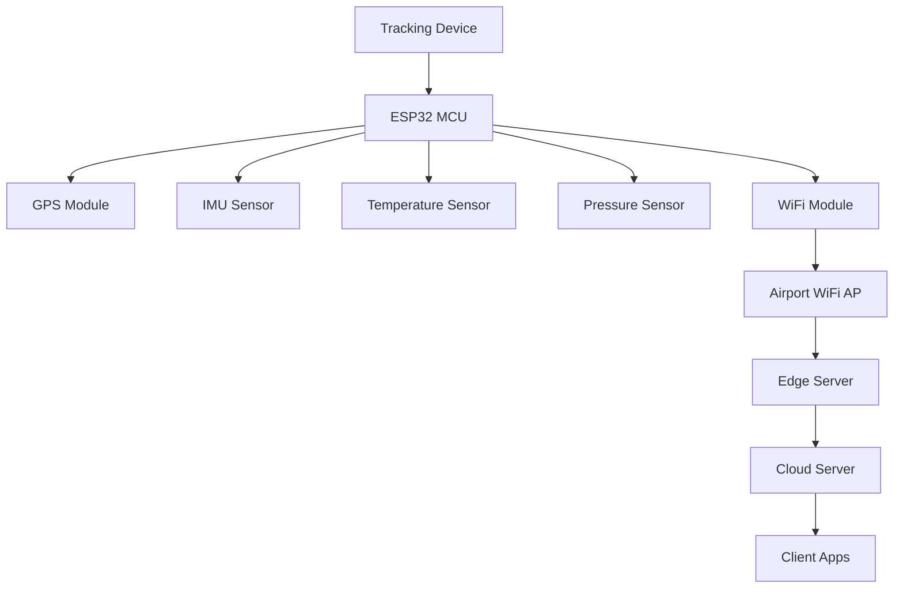
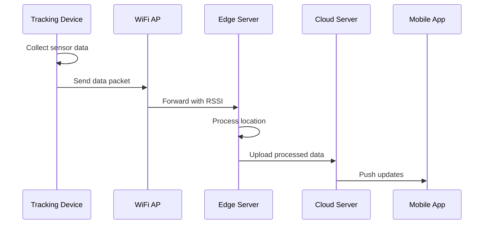

# Sensor System Architecture

## 1. Core Sensors Per Tracking Device

### GPS Module
- Model: NEO-M8N GPS Module
- Specs: 
  - Update rate: 10Hz
  - Accuracy: 2.5m
  - Power: 3.3V, 45mA
- Connection: UART/I2C to MCU
- Purpose: Primary outdoor positioning

### IMU (Inertial Measurement Unit)
- Model: MPU-6050
- Components:
  - 3-axis accelerometer
  - 3-axis gyroscope
- Specs:
  - Acceleration range: ±2g to ±16g
  - Gyro range: ±250°/s to ±2000°/s
  - Power: 3.3V, 3.9mA
- Connection: I2C to MCU
- Purpose: Motion detection, orientation tracking

### WiFi Module
- Model: ESP32-WROOM-32
- Specs:
  - Dual-core processor
  - 2.4 GHz WiFi
  - BLE support
  - Power: 3.3V, 80mA active
- Connection: Integrated MCU
- Purpose: Indoor positioning, data transmission

### Environmental Sensors
1. Temperature Sensor (HTU21D)
   - Range: -40°C to +125°C
   - Accuracy: ±0.3°C
   - Power: 3.3V, 0.45mA
   - Connection: I2C to MCU

2. Pressure Sensor (BMP280)
   - Range: 300-1100 hPa
   - Accuracy: ±1 hPa
   - Power: 3.3V, 2.7μA
   - Connection: I2C to MCU

## 2. System Connectivity



## 3. Hardware Integration

### MCU Connections
```
ESP32 Pin Configuration:
- GPS: UART
  - TX: GPIO16
  - RX: GPIO17
- IMU: I2C
  - SDA: GPIO21
  - SCL: GPIO22
- Temperature: I2C (shared)
- Pressure: I2C (shared)
```

### Power Management
```
Power Distribution:
- Main Battery: 3.7V LiPo, 2500mAh
- Voltage Regulator: 3.3V output
- Power Modes:
  - Active: ~150mA
  - Sleep: ~2mA
  - Deep Sleep: ~10µA
```

## 4. Communication Protocol

### Local Communication (Sensors to MCU)
```c
struct SensorData {
    float gps_lat;
    float gps_lon;
    float acc_x, acc_y, acc_z;
    float gyro_x, gyro_y, gyro_z;
    float temperature;
    float pressure;
    uint8_t battery_level;
};
```

### Server Communication (Device to Cloud)
```json
{
    "device_id": "DV123456",
    "timestamp": "2025-01-08T12:34:56Z",
    "data": {
        "location": {
            "lat": 51.5074,
            "lon": -0.1278
        },
        "motion": {
            "acceleration": [0.1, 0.2, 9.8],
            "gyro": [0.01, 0.02, 0.03]
        },
        "environment": {
            "temp": 23.5,
            "pressure": 1013.25
        },
        "battery": 85
    }
}
```

## 5. Network Infrastructure

### WiFi Access Points
- Coverage: 1 AP per 500 sq ft
- Model: Cisco Meraki MR46
- Features:
  - WiFi 6 (802.11ax)
  - RSSI tracking
  - Location analytics
  - Load balancing

### Edge Servers
- Location: One per terminal section
- Hardware: 
  - CPU: Intel Xeon E-2288G
  - RAM: 64GB
  - Storage: 1TB NVMe
- Purpose:
  - Local data processing
  - Temporary storage
  - Real-time analytics

## 6. Integration Diagram


